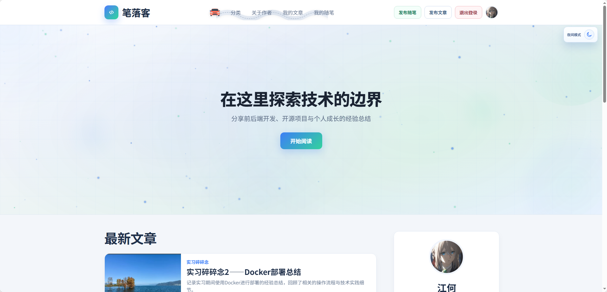
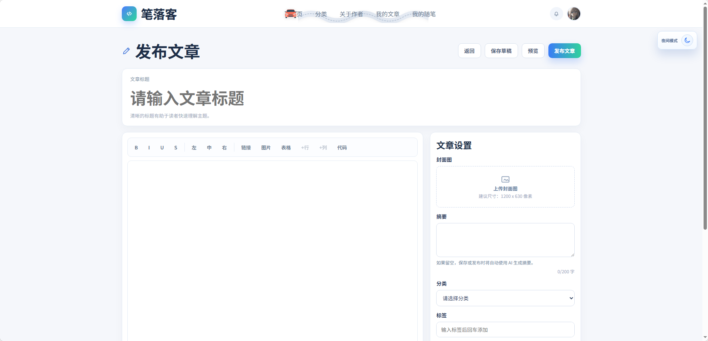
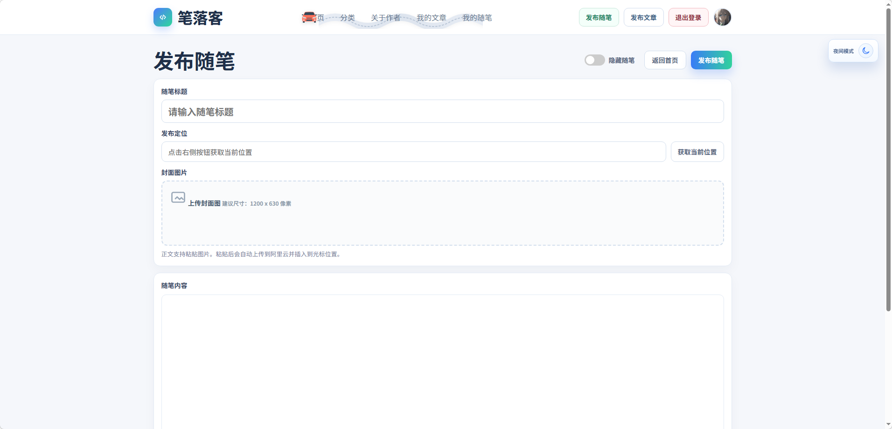
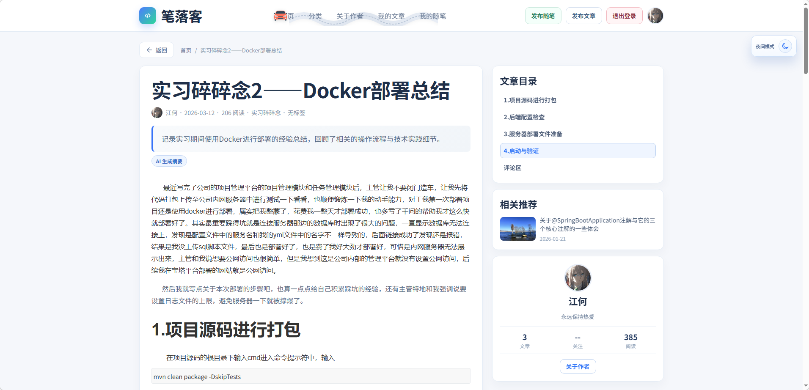

<div align="center">

# 笔落客 (TechVibe Blog)

**[English Version](#english-version)** | 中文版

一个现代化的个人技术博客系统，支持文章发布、随笔记录、用户互动等功能。

[](https://spring.io/projects/spring-boot)
[](https://www.oracle.com/java/)
[](LICENSE)
[](https://github.com/username/tche-blog)

</div>

## 目录

- [项目简介](#项目简介)
- [功能特性](#功能特性)
- [技术栈](#技术栈)
- [项目结构](#项目结构)
- [快速开始](#快速开始)
- [环境配置](#环境配置)
- [API 接口](#api-接口)
- [截图预览](#截图预览)
- [贡献指南](#贡献指南)
- [开源协议](#开源协议)
- [联系方式](#联系方式)

## 项目简介

笔落客是一个基于 Spring Boot + 原生 JavaScript 构建的全栈博客系统。采用前后端分离架构，提供完整的文章管理、随笔记录、用户认证、互动评论等功能。界面设计简洁现代，支持响应式布局。

## 功能特性

### 文章管理
- 文章发布、编辑、删除
- 草稿保存与智能查询
- 文章分类与标签管理
- 封面图上传
- AI 智能摘要生成（集成智谱 GLM-4）
- 定时发布功能
- 富文本编辑器（支持表格、图片、代码等）

### 随笔功能
- 随手记录生活点滴
- 地理位置标记（集成高德地图 API）
- 图片上传与展示

### 用户系统
- 用户注册与登录
- 邮箱验证码验证
- 个人资料管理
- 头像上传

### 互动功能
- 文章点赞与收藏
- 评论系统
- 浏览量统计

### 其他特性
- 音乐播放器
- 操作日志记录
- 响应式设计，支持移动端
- 暗色模式支持

## 技术栈

### 后端

| 技术 | 版本 | 说明 |
|------|------|------|
| Spring Boot | 3.3.5 | 基础框架 |
| Java | 17 | 开发语言 |
| MyBatis Plus | 3.5.7 | ORM框架 |
| MySQL | 8.0 | 数据库 |
| Aliyun OSS | 3.17.4 | 对象存储 |
| Spring Mail | - | 邮件服务 |
| Spring Security Crypto | - | 密码加密 |
| Spring AOP | - | 切面编程 |
| Lombok | - | 代码简化 |

### 前端

| 技术 | 版本 | 说明 |
|------|------|------|
| JavaScript | ES6+ | 原生JS，无框架依赖 |
| Vite | 5.4.21 | 构建工具 |
| CSS3 | - | 自定义样式，响应式设计 |
| Google Fonts | - | Manrope、Noto Sans SC 字体 |

## 项目结构

```
tche_blog/
├── Back_end/                    # 后端项目
│   ├── sql/                     # 数据库脚本
│   │   └── tche_blog.sql
│   ├── src/
│   │   └── main/
│   │       ├── java/com/tche/blog/
│   │       │   ├── config/      # 配置类
│   │       │   ├── controller/  # 控制器
│   │       │   ├── service/     # 服务层
│   │       │   ├── mapper/      # 数据访问层
│   │       │   ├── model/       # 实体类
│   │       │   ├── dto/         # 数据传输对象
│   │       │   ├── common/      # 公共组件
│   │       │   ├── aop/         # 切面
│   │       │   └── task/        # 定时任务
│   │       └── resources/
│   │           ├── mapper/      # MyBatis XML
│   │           ├── application.yml
│   │           └── application-prod.yml
│   └── pom.xml
│
└── Front_end/                   # 前端项目
    ├── public/                  # 静态资源
    ├── index.html               # 首页
    ├── article-detail.html      # 文章详情
    ├── article-edit.html        # 文章编辑
    ├── essay-detail.html        # 随笔详情
    ├── auth.html                # 登录注册
    ├── profile.html             # 个人中心
    ├── site-api.js              # API 封装
    ├── site-session.js          # 会话管理
    └── vite.config.mjs          # Vite 配置
```

## 快速开始

### 环境要求

- JDK 17+
- Maven 3.6+
- MySQL 8.0+
- Node.js 18+（仅前端构建需要）

### 安装步骤

1. 克隆仓库
```bash
git clone https://github.com/username/tche-blog.git
cd tche_blog
```

2. 数据库配置
```sql
CREATE DATABASE tche_blog CHARACTER SET utf8mb4 COLLATE utf8mb4_general_ci;
```

3. 导入数据库脚本
```bash
mysql -u root -p tche_blog < Back_end/sql/tche_blog.sql
```

4. 启动后端
```bash
cd Back_end
mvn clean package -DskipTests
java -jar target/tche-blog-backend-1.0.0.jar
```

5. 启动前端（可选）
```bash
cd Front_end
npm install
npm run dev
```

## 环境配置

本项目使用环境变量管理敏感配置，所有敏感信息通过环境变量注入，避免硬编码。

### 数据库配置

| 环境变量 | 说明 | 默认值 |
|----------|------|--------|
| `DB_HOST` | 数据库地址 | `127.0.0.1` |
| `DB_PORT` | 数据库端口 | `3306` |
| `DB_NAME` | 数据库名称 | `tche_blog` |
| `DB_USERNAME` | 数据库用户名 | `root` |
| `DB_PASSWORD` | 数据库密码 | - |

### 邮件服务配置

| 环境变量 | 说明 | 默认值 |
|----------|------|--------|
| `MAIL_HOST` | SMTP 服务器地址 | `smtp.qq.com` |
| `MAIL_PORT` | SMTP 端口 | `587` |
| `MAIL_USERNAME` | 邮箱账号 | - |
| `MAIL_PASSWORD` | 邮箱授权码 | - |

### 阿里云 OSS 配置（可选）

| 环境变量 | 说明 | 默认值 |
|----------|------|--------|
| `ALIYUN_OSS_ENABLED` | 是否启用 OSS | `false` |
| `ALIYUN_OSS_ENDPOINT` | OSS Endpoint | - |
| `ALIYUN_OSS_ACCESS_KEY_ID` | AccessKey ID | - |
| `ALIYUN_OSS_ACCESS_KEY_SECRET` | AccessKey Secret | - |
| `ALIYUN_OSS_BUCKET_NAME` | Bucket 名称 | - |

### AI 摘要配置（可选）

| 环境变量 | 说明 | 默认值 |
|----------|------|--------|
| `AI_SUMMARY_ENABLED` | 是否启用 AI 摘要 | `false` |
| `AI_SUMMARY_API_KEY` | 智谱 API Key | - |
| `AI_SUMMARY_MODEL` | 模型名称 | `glm-4` |

### 高德地图配置（可选）

| 环境变量 | 说明 | 默认值 |
|----------|------|--------|
| `AMAP_ENABLED` | 是否启用高德地图 | `false` |
| `AMAP_WEB_SERVICE_KEY` | 高德 Web 服务 Key | - |

### 启动示例

```bash
# Linux/macOS
export DB_PASSWORD=your_password
export MAIL_USERNAME=your_email@qq.com
export MAIL_PASSWORD=your_email_auth_code
java -jar tche-blog-backend-1.0.0.jar

# Windows PowerShell
$env:DB_PASSWORD="your_password"
$env:MAIL_USERNAME="your_email@qq.com"
$env:MAIL_PASSWORD="your_email_auth_code"
java -jar tche-blog-backend-1.0.0.jar
```

## API 接口

### 认证相关
- `POST /api/auth/login` - 用户登录
- `POST /api/auth/register` - 用户注册
- `GET /api/auth/captcha` - 获取验证码

### 文章相关
- `GET /api/articles` - 获取文章列表
- `GET /api/articles/{id}` - 获取文章详情
- `POST /api/articles` - 创建文章
- `PUT /api/articles/{id}` - 更新文章
- `DELETE /api/articles/{id}` - 删除文章
- `GET /api/articles/drafts/search` - 搜索草稿

### 随笔相关
- `GET /api/essays` - 获取随笔列表
- `GET /api/essays/{id}` - 获取随笔详情
- `POST /api/essays` - 创建随笔

### 用户相关
- `GET /api/profile` - 获取个人信息
- `PUT /api/profile` - 更新个人信息

## 截图预览

可以点击链接进入我的网站查看 http://82.156.248.16/



首页展示文章列表，支持分类筛选和关键词搜索



文章编辑器支持富文本编辑、图片上传、表格插入等功能



随笔页面展示地理位置和图片



文章详情页展示完整内容

## 贡献指南

欢迎提交 Issue 和 Pull Request！

1. Fork 本仓库
2. 创建特性分支 (`git checkout -b feature/AmazingFeature`)
3. 提交更改 (`git commit -m 'Add some AmazingFeature'`)
4. 推送到分支 (`git push origin feature/AmazingFeature`)
5. 提交 Pull Request

## 开源协议

本项目采用 [MIT License](LICENSE) 开源协议。

## 联系方式

如有问题或建议，欢迎通过以下方式联系：

- 提交 Issue
- 发送邮件 469314046@qq.com

---

**笔落客** - 记录技术，分享生活

---

<div align="center">

# English Version {#english-version}

# TechVibe Blog

**[中文版](#笔落客-techvibe-blog)** | English Version

A modern personal technical blog system supporting article publishing, essay recording, and user interaction.

[](https://spring.io/projects/spring-boot)
[](https://www.oracle.com/java/)
[](LICENSE)
[](https://github.com/username/tche-blog)

## Table of Contents

- [Overview](#overview)
- [Features](#features)
- [Tech Stack](#tech-stack)
- [Project Structure](#project-structure)
- [Quick Start](#quick-start)
- [Configuration](#configuration)
- [API Reference](#api-reference)
- [Screenshots](#screenshots)
- [Contributing](#contributing)
- [License](#license)
- [Contact](#contact)

## Overview

TechVibe Blog is a full-stack blog system built with Spring Boot and vanilla JavaScript. It adopts a front-end and back-end separation architecture, providing complete article management, essay recording, user authentication, interactive comments, and more. The interface is clean and modern with responsive design support.

## Features

### Article Management
- Article publishing, editing, and deletion
- Draft saving and smart search
- Article categories and tags management
- Cover image upload
- AI-powered summary generation (integrated with Zhipu GLM-4)
- Scheduled publishing
- Rich text editor (supports tables, images, code, etc.)

### Essay Feature
- Record life moments
- Geolocation tagging (integrated with Amap API)
- Image upload and display

### User System
- User registration and login
- Email verification code
- Profile management
- Avatar upload

### Interactive Features
- Article likes and favorites
- Comment system
- View count statistics

### Other Features
- Music player
- Operation log recording
- Responsive design, mobile-friendly
- Dark mode support

## Tech Stack

### Backend

| Technology | Version | Description |
|------------|---------|-------------|
| Spring Boot | 3.3.5 | Core framework |
| Java | 17 | Programming language |
| MyBatis Plus | 3.5.7 | ORM framework |
| MySQL | 8.0 | Database |
| Aliyun OSS | 3.17.4 | Object storage |
| Spring Mail | - | Email service |
| Spring Security Crypto | - | Password encryption |
| Spring AOP | - | Aspect-oriented programming |
| Lombok | - | Code simplification |

### Frontend

| Technology | Version | Description |
|------------|---------|-------------|
| JavaScript | ES6+ | Vanilla JS, no framework dependency |
| Vite | 5.4.21 | Build tool |
| CSS3 | - | Custom styles, responsive design |
| Google Fonts | - | Manrope, Noto Sans SC fonts |

## Project Structure

```
tche_blog/
├── Back_end/                    # Backend project
│   ├── sql/                     # Database scripts
│   │   └── tche_blog.sql
│   ├── src/
│   │   └── main/
│   │       ├── java/com/tche/blog/
│   │       │   ├── config/      # Configuration classes
│   │       │   ├── controller/  # Controllers
│   │       │   ├── service/     # Service layer
│   │       │   ├── mapper/      # Data access layer
│   │       │   ├── model/       # Entity classes
│   │       │   ├── dto/         # Data transfer objects
│   │       │   ├── common/      # Common components
│   │       │   ├── aop/         # Aspects
│   │       │   └── task/        # Scheduled tasks
│   │       └── resources/
│   │           ├── mapper/      # MyBatis XML
│   │           ├── application.yml
│   │           └── application-prod.yml
│   └── pom.xml
│
└── Front_end/                   # Frontend project
    ├── public/                  # Static assets
    ├── index.html               # Homepage
    ├── article-detail.html      # Article detail
    ├── article-edit.html        # Article editor
    ├── essay-detail.html        # Essay detail
    ├── auth.html                # Login/Register
    ├── profile.html             # User profile
    ├── site-api.js              # API wrapper
    ├── site-session.js          # Session management
    └── vite.config.mjs          # Vite configuration
```

## Quick Start

### Requirements

- JDK 17+
- Maven 3.6+
- MySQL 8.0+
- Node.js 18+ (for frontend build only)

### Installation

1. Clone the repository
```bash
git clone https://github.com/username/tche-blog.git
cd tche_blog
```

2. Database setup
```sql
CREATE DATABASE tche_blog CHARACTER SET utf8mb4 COLLATE utf8mb4_general_ci;
```

3. Import database script
```bash
mysql -u root -p tche_blog < Back_end/sql/tche_blog.sql
```

4. Start backend
```bash
cd Back_end
mvn clean package -DskipTests
java -jar target/tche-blog-backend-1.0.0.jar
```

5. Start frontend (optional)
```bash
cd Front_end
npm install
npm run dev
```

## Configuration

This project uses environment variables to manage sensitive configurations. All sensitive information is injected through environment variables to avoid hardcoding.

### Database Configuration

| Variable | Description | Default |
|----------|-------------|---------|
| `DB_HOST` | Database host | `127.0.0.1` |
| `DB_PORT` | Database port | `3306` |
| `DB_NAME` | Database name | `tche_blog` |
| `DB_USERNAME` | Database username | `root` |
| `DB_PASSWORD` | Database password | - |

### Email Service Configuration

| Variable | Description | Default |
|----------|-------------|---------|
| `MAIL_HOST` | SMTP server address | `smtp.qq.com` |
| `MAIL_PORT` | SMTP port | `587` |
| `MAIL_USERNAME` | Email account | - |
| `MAIL_PASSWORD` | Email authorization code | - |

### Aliyun OSS Configuration (Optional)

| Variable | Description | Default |
|----------|-------------|---------|
| `ALIYUN_OSS_ENABLED` | Enable OSS | `false` |
| `ALIYUN_OSS_ENDPOINT` | OSS Endpoint | - |
| `ALIYUN_OSS_ACCESS_KEY_ID` | AccessKey ID | - |
| `ALIYUN_OSS_ACCESS_KEY_SECRET` | AccessKey Secret | - |
| `ALIYUN_OSS_BUCKET_NAME` | Bucket name | - |

### AI Summary Configuration (Optional)

| Variable | Description | Default |
|----------|-------------|---------|
| `AI_SUMMARY_ENABLED` | Enable AI summary | `false` |
| `AI_SUMMARY_API_KEY` | Zhipu API Key | - |
| `AI_SUMMARY_MODEL` | Model name | `glm-4` |

### Amap Configuration (Optional)

| Variable | Description | Default |
|----------|-------------|---------|
| `AMAP_ENABLED` | Enable Amap | `false` |
| `AMAP_WEB_SERVICE_KEY` | Amap Web Service Key | - |

### Startup Commands

```bash
# Linux/macOS
export DB_PASSWORD=your_password
export MAIL_USERNAME=your_email@example.com
export MAIL_PASSWORD=your_email_auth_code
java -jar tche-blog-backend-1.0.0.jar

# Windows PowerShell
$env:DB_PASSWORD="your_password"
$env:MAIL_USERNAME="your_email@example.com"
$env:MAIL_PASSWORD="your_email_auth_code"
java -jar tche-blog-backend-1.0.0.jar
```

## API Reference

### Authentication
- `POST /api/auth/login` - User login
- `POST /api/auth/register` - User registration
- `GET /api/auth/captcha` - Get captcha

### Articles
- `GET /api/articles` - Get article list
- `GET /api/articles/{id}` - Get article detail
- `POST /api/articles` - Create article
- `PUT /api/articles/{id}` - Update article
- `DELETE /api/articles/{id}` - Delete article
- `GET /api/articles/drafts/search` - Search drafts

### Essays
- `GET /api/essays` - Get essay list
- `GET /api/essays/{id}` - Get essay detail
- `POST /api/essays` - Create essay

### User
- `GET /api/profile` - Get user profile
- `PUT /api/profile` - Update user profile

## Screenshots

Visit the live demo: http://82.156.248.16/


Homepage displays article list with category filtering and keyword search


Article editor supports rich text editing, image upload, table insertion, and more


Essay page displays geolocation and images


Article detail page shows complete content

## Contributing

Issues and Pull Requests are welcome!

1. Fork this repository
2. Create a feature branch (`git checkout -b feature/AmazingFeature`)
3. Commit your changes (`git commit -m 'Add some AmazingFeature'`)
4. Push to the branch (`git push origin feature/AmazingFeature`)
5. Submit a Pull Request

## License

This project is licensed under the [MIT License](LICENSE).

## Contact

If you have any questions or suggestions, feel free to:

- Submit an Issue
- Send an email l30675042322025@gmail.com

---

**TechVibe Blog** - Record Technology, Share Life

</div>
